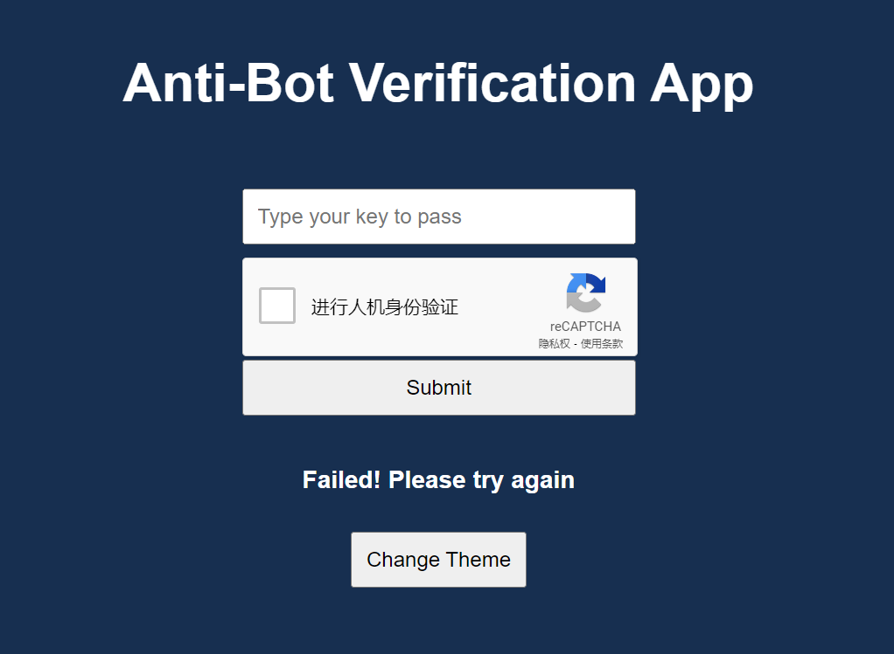

# Anti-Bot Verification App

This is a simple application built with React that integrates Google reCAPTCHA verification to prevent bots from submitting forms.

这是一个使用 React 构建的简单应用，集成了 Google reCAPTCHA 验证，旨在防止机器人提交表单。



# Project Introduction / 项目简介
This project is a Show and Tell assignment for the CS391 course, demonstrating how to integrate Google reCAPTCHA verification in a React application. Users need to enter a specific text and pass the reCAPTCHA verification to successfully submit the form.

本项目是 CS391 课程的 Show and Tell 作业，展示了如何在 React 应用中集成 Google reCAPTCHA 验证。用户需要输入特定的文本并通过 reCAPTCHA 验证才能成功提交表单。


## Tech Stack / 技术栈

- [React](https://reactjs.org/)
- [Vite](https://vitejs.dev/)
- [Styled Components](https://styled-components.com/)
- [Google reCAPTCHA](https://www.google.com/recaptcha/)

## Installation and Running / 安装与运行

1. Clone the project to your local machine / 克隆项目到本地：

   ```bash
   git clone https://github.com/your-username/show-and-tell.git
   cd show-and-tell

2. Install dependencies / 安装必要组件： 
   ```bash 
   npm install

3. Set your reCAPTCHA site key and verification key in main.jsx / 在 main.jsx 中设置 reCAPTCHA site key 和验证密钥

   Open main.jsx and replace the siteKey variable with your own reCAPTCHA site key. Replace the veriKey variable with your desired verification keyword. / 打开 main.jsx 并用你自己的 reCAPTCHA site key 替换 siteKey 变量。用你想要的验证关键词替换 veriKey 变量。
   ```bash
   const siteKey = "YOUR_RECAPTCHA_SITE_KEY";
   const veriKey = 'YOUR_VERIFICATION_KEY';

4. Start the development server / 启动开发服务器：
   ```bash
   npm run dev

5. Open your browser and visit http://localhost:5173 to test / 打开浏览器，访问 http://localhost:5173 进行测试。

Note: Vite's default local host is 5173, while other development servers, such as Create React App, typically use 3000 as the default port.

注意：Vite 的默认本地主机是 5173，而其他开发服务器（如 Create React App）通常使用 3000 作为默认端口。

## Notes on reCAPTCHA / 关于 reCAPTCHA 的注意事项

Recommended version: It is recommended to use Google reCAPTCHA v2 as v3 might cause bugs.
  
推荐版本: 建议使用 Google reCAPTCHA v2，因为 v3 可能会导致 bug。

Integration: This application uses react-google-recaptcha for integration.

集成: 本应用程序使用 react-google-recaptcha 进行集成。

## Usage / 使用说明
1. Enter the specified text in the input field. / 在输入框中输入指定的文本。
2. Complete the reCAPTCHA verification. / 完成 reCAPTCHA 验证。
3. Click the "Submit" button to submit the form. / 点击“提交”按钮提交表单。
4. Use the "Change Theme" button to switch between light and dark themes. / 使用“更改主题”按钮在明亮和黑暗主题之间切换。

## Project Files Description / 项目文件说明
AntiBot.jsx: Main application component, includes the form and reCAPTCHA integration.

main.jsx: Entry file of the application, responsible for rendering the AntiBot component with the provided siteKey and verification key.

index.html: HTML template file of the application.

vite.config.js: Vite configuration file for development server and proxy settings.

AntiBot.jsx: 主应用组件，包含表单和 reCAPTCHA 集成。

main.jsx: 应用的入口文件，负责使用提供的 siteKey 和验证密钥渲染 AntiBot 组件。

index.html: 应用的 HTML 模板文件。

vite.config.js: Vite 配置文件，用于开发服务器和代理配置。

